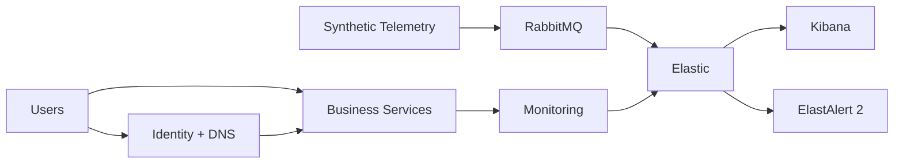

# Northstar Enterprise Lab

## A synthetic enterprise infrastructure and operations lab

Northstar is a portfolio project that models how a small-to-medium multi-site enterprise can be built, operated, monitored and troubleshot using reproducible infrastructure, automation and controlled incident scenarios.

> Everything in Northstar is synthetic. No employer data, credentials, configurations, naming conventions or production records are included.

## What is inside

```text
Northstar
├── Enterprise architecture
├── Hyper-V infrastructure model
├── Network segmentation and firewall policy
├── Active Directory and identity model
├── File, print, IIS/application and database services
├── Synthetic workload generation
├── RabbitMQ telemetry
├── Elastic/Kibana observability
├── ElastAlert 2 detection concepts
├── Operations and troubleshooting guides
├── Evidence capture tooling
└── Five controlled incident scenarios
```

## Architecture



## Skills demonstrated
- Windows Server and Active Directory
- DNS and enterprise service dependencies
- Hyper-V lab architecture
- VLAN/network segmentation concepts
- PowerShell operations automation
- Python/structured telemetry concepts
- IIS/application operations
- SQL service dependencies
- RabbitMQ messaging
- Elastic observability
- alerting and incident response
- troubleshooting and root-cause analysis

## Start here
1. Read `BUILD-ORDER.md`.
2. Review `architecture/ENTERPRISE-ARCHITECTURE.md`.
3. Review `WORKLOAD-MODEL.md`.
4. Run the documented deployment steps.
5. Generate synthetic workload data.
6. Validate health and services.
7. Run one of the five controlled scenarios.
8. Capture evidence and validate recovery.

## Incident scenarios
- NS-INC-01 — Telemetry backlog
- NS-INC-02 — Identity/DNS failure
- NS-INC-03 — Print outage
- NS-INC-04 — IIS/application outage
- NS-INC-05 — Capacity alert

## Why this exists
Northstar is designed to demonstrate that infrastructure work is more than provisioning servers. A useful environment has dependencies, operational signals, monitoring, failure modes, recovery procedures and evidence.

## Core principle
**Build it. Operate it. Break it safely. Detect it. Fix it. Prove recovery.**
