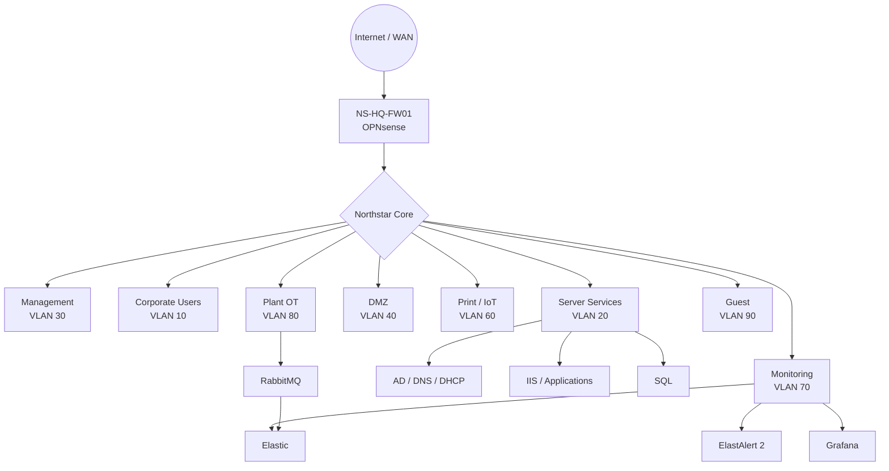

# Northstar Manufacturing Group — Enterprise Infrastructure Lab

> **A fictional, synthetic enterprise built for infrastructure engineering, monitoring, security and incident-response practice.**

Northstar Manufacturing Group is the flagship lab in this repository. It deliberately looks and behaves like a believable mid-sized multi-site company while containing **no employer, customer, production, tenant or proprietary data**.

## What this lab demonstrates

- Hyper-V virtual infrastructure
- Active Directory, DNS and DHCP
- Privileged administration and management zones
- Segmented VLAN-style networks
- OPNsense firewalling, routing and site boundaries
- IIS/application/database services
- File and print services
- Windows and Linux operations
- Elastic ingestion and investigation
- ElastAlert 2 rule-based alerting
- Zabbix/Grafana-style monitoring patterns
- RabbitMQ-backed OT telemetry
- Service-desk and incident workflows
- Failure injection, investigation, recovery and RCA

## Architecture at a glance

## Quick start order

1. Read [architecture/network.md](architecture/network.md)
2. Read [architecture/naming-standards.md](architecture/naming-standards.md)
3. Build the Hyper-V networking layer with `hyperv/New-NorthstarNetwork.ps1`
4. Create core VMs with `hyperv/New-NorthstarVM.ps1`
5. Deploy the AD baseline from `active-directory/`
6. Configure OPNsense from `opnsense/README.md`
7. Start the monitoring stack from `monitoring/README.md`
8. Enable ElastAlert 2 rules from `elastalert2/`
9. Run an incident from `incidents/`

## Execution model

This lab is intentionally modular. Do not run every VM unless your host can support it.

| Profile | Purpose |
|---|---|
| `CORE` | AD, management, file/print and a small client set |
| `CORPORATE` | Adds application and SQL workloads |
| `MONITORING` | Adds Elastic, ElastAlert 2 and dashboards |
| `INCIDENT` | Adds the systems required for a failure scenario |
| `FULL-DEMO` | Full showcase environment |

## Safety and realism

- All users are synthetic.
- All domains, names and addresses are lab-only.
- Do not expose lab management services directly to the internet.
- Keep secrets out of Git.
- Treat alert examples as defensive detection exercises, not production security controls.

## Repository map

- `architecture/` — diagrams, addressing, naming and design decisions
- `hyperv/` — host-side build automation
- `opnsense/` — firewall/router deployment notes
- `active-directory/` — identity baseline
- `monitoring/` — monitoring stack documentation
- `elastalert2/` — configuration and detection rules
- `incidents/` — reproducible operational scenarios
- `docs/` — build/runbooks and decision records
