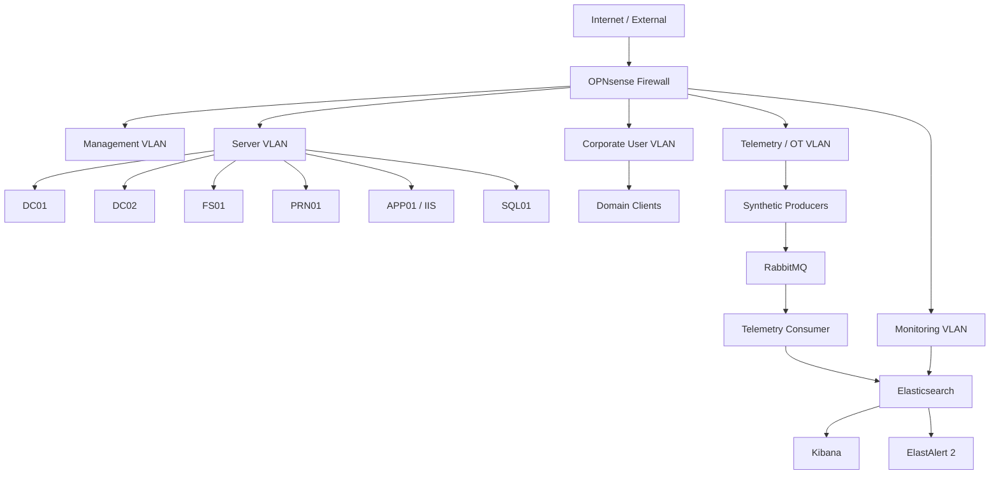

# Northstar Enterprise Lab — Enterprise Architecture

## Synthetic organisation model
Northstar represents a medium-sized multi-site enterprise with central infrastructure, segmented user/server workloads and a small production-style telemetry environment.

## Core layers

### Edge and segmentation
OPNsense provides the lab's routed boundaries and policy enforcement. Segments are designed around management, infrastructure, users, telemetry and monitoring responsibilities.

### Identity
Two domain controllers model resilient AD/DNS services. The identity model separates ordinary users, service identities and privileged administration.

### Business services
File, print, application and database services provide realistic operational dependencies for incidents and troubleshooting.

### Monitoring and telemetry
The monitoring layer is independent enough to demonstrate detection and investigation when individual business services fail.

## Design principles
- synthetic data only;
- explicit segmentation;
- dependency-aware troubleshooting;
- observable workloads;
- reproducible incident scenarios;
- automation where it improves consistency;
- documentation treated as part of the system.

## What this demonstrates
- Hyper-V lab design;
- enterprise identity concepts;
- DNS and service dependencies;
- network segmentation;
- Windows/Linux operations;
- PowerShell/Python automation;
- RabbitMQ messaging;
- Elastic observability;
- alerting and incident response;
- root-cause-driven troubleshooting.
