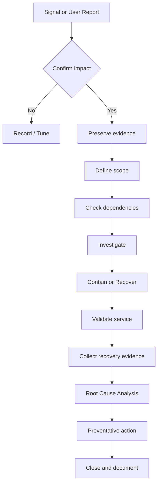

# Northstar Enterprise Lab — Incident Lifecycle

## 1. Detection
Signals may come from alerting, dashboards, telemetry, logs or users.

## 2. Triage
Determine:
- what is affected;
- who is affected;
- when it started;
- whether the issue is growing;
- whether a safe workaround exists.

## 3. Evidence preservation
Capture current state before destructive or disruptive recovery actions.

## 4. Investigation
Use the dependency map and telemetry path to move from symptom toward cause.

## 5. Recovery
Choose the smallest safe action that restores service. Avoid using restarts as a substitute for diagnosis.

## 6. Validation
Confirm recovery from the user/service perspective and confirm monitoring reflects the restored state.

## 7. RCA
Document:
- triggering condition;
- technical root cause;
- contributing factors;
- why detection worked or failed;
- corrective actions;
- preventative actions.

## Evidence pack
Every scenario should leave behind an evidence pack containing the timeline, checks, logs, recovery steps and validation outcome.
