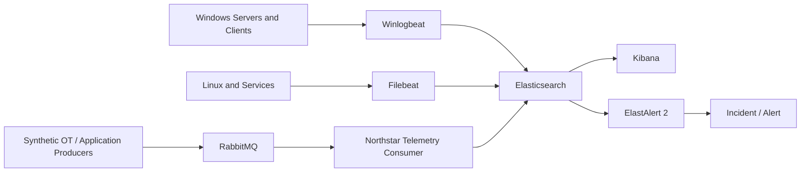

# Northstar Enterprise Lab — Telemetry and Data Flow

## Overview

## Data sources

### Windows
Synthetic Windows infrastructure supplies event-driven operational evidence such as authentication, service and application events.

### Linux and service logs
Linux-based services supply application and platform logs through Filebeat-style ingestion.

### Synthetic telemetry
Synthetic producers model production-style metrics and events. They are intentionally generated for demonstration and contain no historical workplace data.

## RabbitMQ path
1. Producer publishes telemetry.
2. Queue buffers messages.
3. Consumer processes messages.
4. Consumer emits structured records.
5. Records are indexed or handed to the downstream ingestion path.

## Elastic path
1. Event is accepted.
2. Metadata identifies source, host and event category.
3. Timestamp provides ordering.
4. Indexing makes the event searchable.
5. Kibana supports investigation.
6. ElastAlert 2 evaluates defined conditions.

## Operational fields
The lab should preserve these concepts consistently across synthetic sources:
- `@timestamp`
- source/host identifier
- environment or segment
- event category
- severity
- correlation or workload identifier
- message/metric payload

## Investigation questions
- Did the producer generate the event?
- Did the queue receive it?
- Did the consumer process it?
- Was the event indexed?
- Is the timestamp current?
- Does the alert rule query the correct data?
- Is the condition actually met?

## Failure isolation
The telemetry pipeline is deliberately separable so an incident can be located at producer, transport, consumer, indexing or detection stages rather than being treated as one opaque failure.
