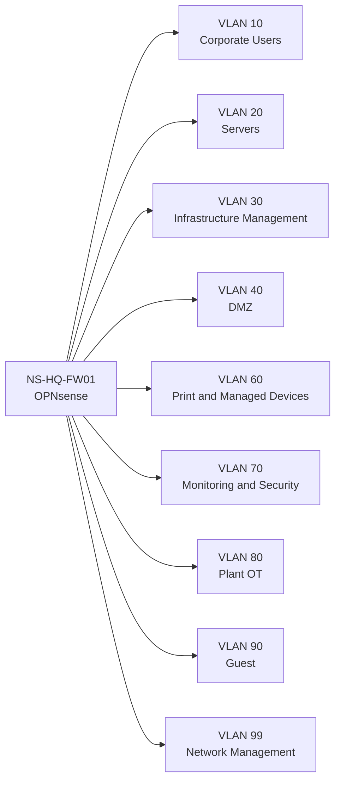

# Network Architecture

Northstar uses purpose-based segmentation rather than pretending that every workload belongs on one flat LAN.

## Logical topology

## Addressing plan

| VLAN | Zone | Subnet | Gateway |
|---:|---|---|---|
| 10 | Corporate users | 10.50.10.0/24 | 10.50.10.1 |
| 20 | Servers | 10.50.20.0/24 | 10.50.20.1 |
| 30 | Infrastructure management | 10.50.30.0/24 | 10.50.30.1 |
| 40 | DMZ | 10.50.40.0/24 | 10.50.40.1 |
| 60 | Print / managed devices | 10.50.60.0/24 | 10.50.60.1 |
| 70 | Monitoring/security | 10.50.70.0/24 | 10.50.70.1 |
| 80 | Plant OT | 10.50.80.0/24 | 10.50.80.1 |
| 90 | Guest | 10.50.90.0/24 | 10.50.90.1 |
| 99 | Network management | 10.50.99.0/24 | 10.50.99.1 |

## Security intent

- Users may reach published corporate services, not arbitrary management ports.
- Management is reachable only from the management zone and approved admin jump host.
- DMZ services have tightly scoped paths into application dependencies.
- OT is treated as a separate trust boundary.
- Monitoring is allowed to collect telemetry but should not become a general administration network.
- Guest traffic is internet-only.

## Hyper-V implementation

The lab can be implemented with one internal vSwitch per security zone, or a smaller number of trunked switches where the host and physical NIC configuration supports VLAN tagging. The first option is easier to understand and safer for a home lab; the second is closer to enterprise virtual switching.

The build scripts create the isolated lab networks only. OPNsense owns routing and inter-zone policy.
