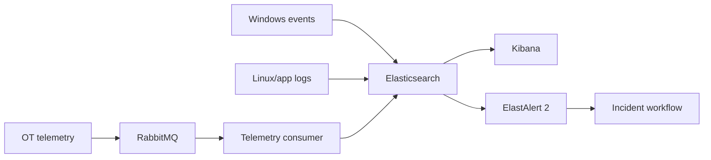

# Northstar Monitoring Stack

This directory packages the monitoring core of the synthetic Northstar Manufacturing Group enterprise lab.

## Components



## Quick start

1. Copy `.env.example` to `.env`.
2. Replace the placeholder RabbitMQ password.
3. Start the stack:

```powershell
./Start-MonitoringStack.ps1 -Detach
```

4. Check service state:

```powershell
docker compose --env-file .env -f compose.monitoring.yml ps
```

5. Open Kibana at `http://localhost:5601`.

## Health model

Elasticsearch, Kibana and RabbitMQ expose container health checks. Kibana and ElastAlert wait for Elasticsearch readiness through Compose dependencies rather than assuming a started container is already usable.

## Safety

- `.env` is intentionally ignored by Git.
- The repository only contains synthetic company names, users and workloads.
- Do not place real employer data, credentials, tokens or production exports in this lab.

## Validation

Run the repository CI for PowerShell/Pester checks. For local Docker validation:

```powershell
docker compose --env-file .env -f compose.monitoring.yml config
docker compose --env-file .env -f compose.monitoring.yml up -d
docker compose --env-file .env -f compose.monitoring.yml ps
```

The stack is designed as a lab foundation. Resource requirements should be adjusted to the host before running the full Hyper-V estate at the same time.
