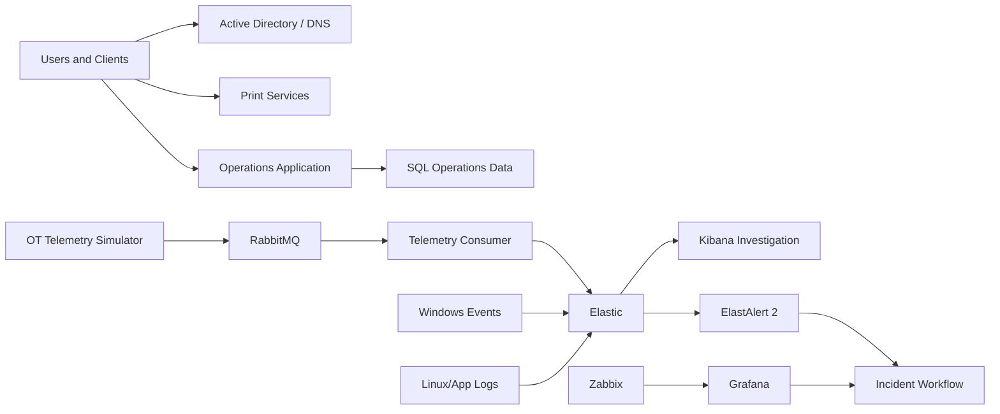

# Northstar Enterprise: Flagship Walkthrough

## Purpose

This walkthrough demonstrates the Northstar environment as a complete synthetic enterprise operations scenario. It is designed to show architecture, automation, monitoring, detection, investigation and recovery without using employer data or production credentials.

## Demo flow

1. Start the required Hyper-V profile.
2. Verify AD/DNS, application and monitoring health.
3. Generate normal client and OT activity.
4. Inject one controlled scenario.
5. Confirm ingestion reaches Elastic.
6. Confirm the detection rule matches.
7. Capture the incident timeline and initial evidence.
8. Restore the affected synthetic service.
9. Verify recovery using the original symptom and monitoring evidence.
10. Complete the incident record with root cause and corrective actions.

## Evidence expected

- Hyper-V VM state
- service health output
- sample log/telemetry documents
- Elastic/Kibana search screenshots
- ElastAlert 2 rule output
- scenario evidence file
- recovery validation

## Architecture principle

The value of the lab is the connection between components. A user symptom should be traceable through infrastructure, telemetry, monitoring, detection and recovery rather than existing as isolated scripts.

## Safe boundary

Northstar is fictional. All users, devices, addresses, incidents and telemetry are synthetic. Run fault injection only inside an isolated lab.
