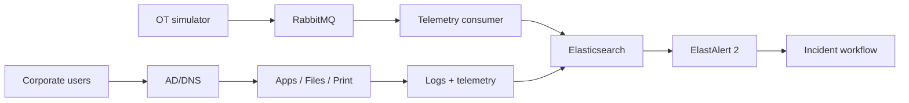

# Northstar Enterprise — 30 Minute Technical Demo

> A synthetic enterprise infrastructure lab for demonstrating identity, infrastructure, monitoring, automation and incident response.

## 0–5 minutes: orientation

Read the root README and architecture documents. The environment is fictional: **Northstar Manufacturing Group**.



## 5–10 minutes: validate configuration

From `labs/northstar-enterprise`:

```powershell
pwsh ./Build-NorthstarLab.ps1 -Phase Network
pwsh ./Build-NorthstarLab.ps1 -Phase Identity
```

Use plan/safe modes where offered before creating Hyper-V resources.

For Docker configuration, inspect the resolved configuration before startup:

```powershell
docker compose -f docker/compose.monitoring.yml config
```

## 10–15 minutes: start monitoring

Copy the example environment file, set local credentials, then start the stack using the repository launcher.

Expected services:

- RabbitMQ
- Elasticsearch
- Kibana
- ElastAlert 2
- Northstar telemetry consumer

## 15–20 minutes: generate telemetry

Run the synthetic telemetry generator in normal mode, then backlog mode. Confirm structured events reach the telemetry output and Elastic ingestion path.

## 20–25 minutes: run an incident

```text
Normal telemetry
      ↓
Controlled backlog
      ↓
Detection threshold crossed
      ↓
ElastAlert 2 rule
      ↓
Incident evidence
```

Run the scenario in its safe/plan mode first. Execute only against the synthetic Northstar lab.

## 25–30 minutes: collect evidence

```powershell
pwsh ./scenarios/Collect-Evidence.ps1 -Scenario TelemetryBacklog -IncludeDockerLogs
```

Review the generated manifest, service state, event exports and container logs. Use the incident runbook to document timeline, root cause, recovery and lessons learned.

## What this demonstrates

- Hyper-V lab architecture
- AD/DNS and enterprise segmentation concepts
- PowerShell automation
- RabbitMQ telemetry
- Elastic-oriented observability
- ElastAlert 2 detection
- controlled incident simulation
- evidence collection and RCA

## Safety boundary

This repository is a synthetic training environment. Do not run incident injectors or infrastructure automation against production systems.
