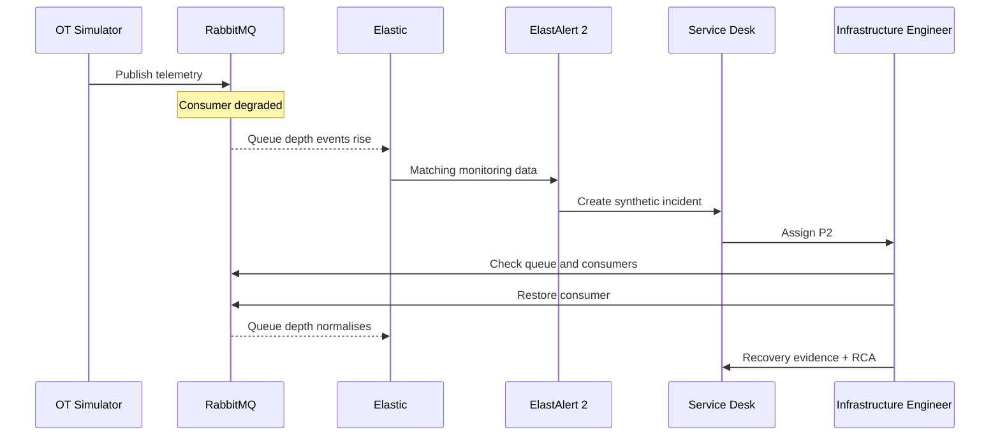

# INC-001 — Plant telemetry backlog

## Summary

A simulated OT telemetry producer continues publishing while downstream consumers stop processing messages. Queue depth rises, production-style telemetry becomes delayed, and an operational alert is generated.

## Story

## Detection

The included rule watches synthetic queue-depth events and requires repeated threshold breaches to reduce noise.

## Investigation checklist

1. Confirm the alert window and affected queue.
2. Check whether producers are still publishing.
3. Check consumer count and consumer errors.
4. Check broker resource state.
5. Confirm downstream ingestion health.
6. Restore the failed/degraded component.
7. Confirm queue depth returns to baseline.
8. Record cause, recovery and prevention action.

## Root-cause variants

Use one variant at a time:

- consumer process stopped
- consumer authentication failure
- downstream endpoint unavailable
- broker resource pressure

## Success criteria

The scenario is complete only when the repository can show:

- synthetic event source
- queue backlog
- detection rule match
- incident record
- investigation notes
- recovery evidence
- post-incident action
