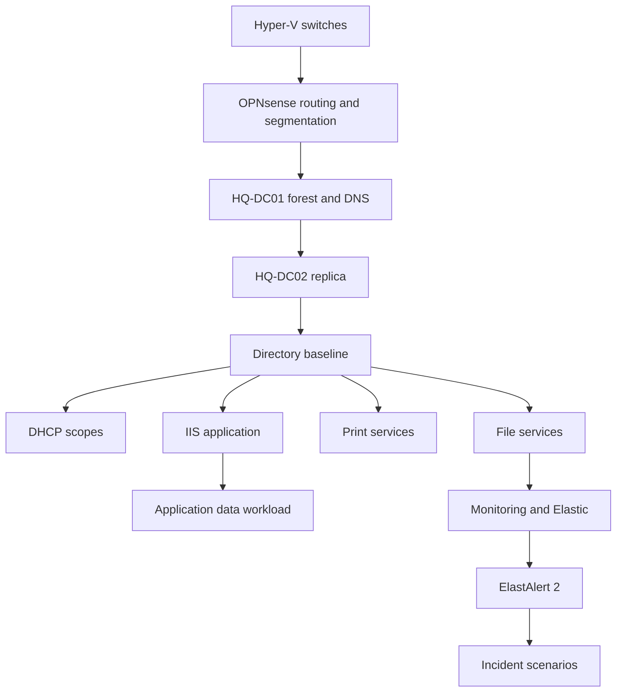

# Northstar Infrastructure Build

This directory contains deployment building blocks for the synthetic Northstar Manufacturing Group environment.

## Build order

## Scripts

| Script | Target | Purpose |
|---|---|---|
| `Initialize-NorthstarDhcp.ps1` | DHCP server | Creates synthetic user/device scopes |
| `Install-NorthstarIISApp.ps1` | HQ-APP01 | Installs IIS and a synthetic operations portal |

## Operational rule

These scripts are **lab automation**, not production deployment templates. Review network addresses, credentials, certificates and firewall policy before running anything.

## Next components

- SQL workload bootstrap
- print queues and GPO deployment
- file-server NTFS ACL baseline
- Windows client join and policy simulation
- telemetry agents and incident injection controls
