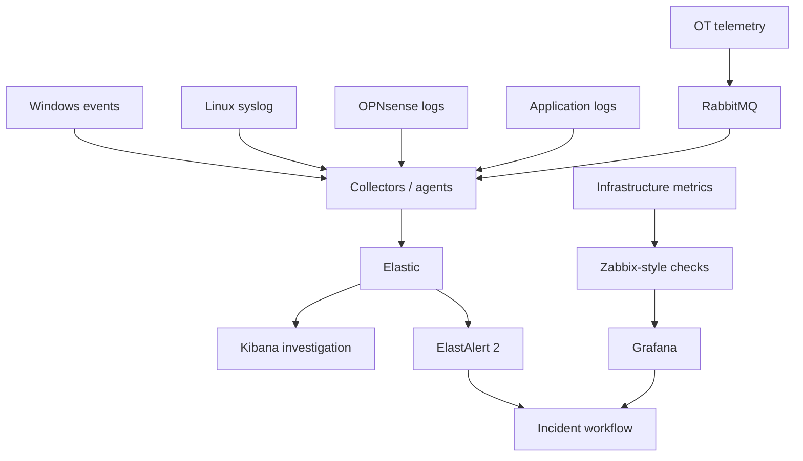

# Monitoring and Observability

Northstar separates infrastructure monitoring from log investigation while allowing both to feed the same incident workflow.

## Operational split

- **Elastic/Kibana:** event search, correlation and investigation
- **ElastAlert 2:** repeatable rule-based alerting
- **Zabbix-style monitoring:** infrastructure state and thresholds
- **Grafana:** operational visibility and trend views

The goal is not to pretend every tool does everything. The goal is to demonstrate how signals become operational work.

## Minimum viable demo

1. Start one Windows client, one Linux server and one monitoring node.
2. Generate normal events.
3. Inject one controlled fault.
4. Confirm telemetry arrives.
5. Confirm the relevant rule/threshold fires.
6. Create a synthetic ticket.
7. Investigate the timeline.
8. Restore the service.
9. Record root cause and recovery evidence.
