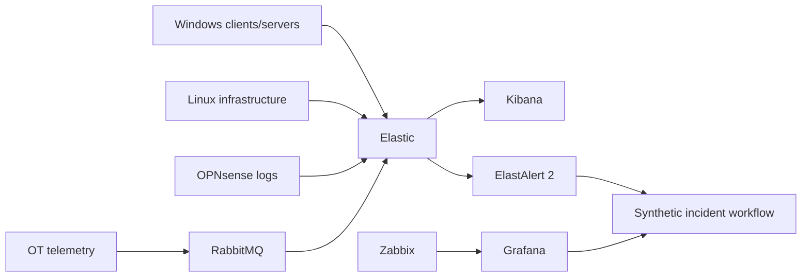

# Northstar Monitoring and Detection

Northstar separates infrastructure monitoring from log investigation while allowing both to feed the same incident workflow.

## Responsibilities

### Elastic

Central event search, correlation and investigation data.

### ElastAlert 2

Rule-based detection against Elasticsearch indexes. The lab uses a mounted configuration and rules directory, following the documented ElastAlert 2 container model. Rules are testable independently before a scenario is demonstrated. citeturn0search2turn0search7

### Zabbix and Grafana

Infrastructure health and operational dashboards are kept conceptually separate from event investigation so the lab demonstrates multiple operational views rather than treating one tool as the answer to every monitoring problem.

## Initial detection set

- failed authentication burst
- privileged group change
- DNS failure pattern
- service stopped
- RabbitMQ queue backlog
- OT telemetry silence
- repeated firewall denies

## Rule testing

Run rule tests against synthetic data before enabling a scenario. The ElastAlert 2 documentation provides a dedicated `elastalert-test-rule` entry point for this workflow. citeturn0search7

## Minimum viable demo

1. Start one Windows client, one Linux server and one monitoring node.
2. Generate normal events.
3. Inject one controlled fault.
4. Confirm telemetry arrives.
5. Confirm the relevant rule or threshold fires.
6. Create a synthetic ticket.
7. Investigate the timeline.
8. Restore the service.
9. Record root cause and recovery evidence.

## Operational principle

Every alert should answer:

1. What changed?
2. Why did the rule match?
3. What evidence is available?
4. Who owns the first response?
5. How is recovery verified?
