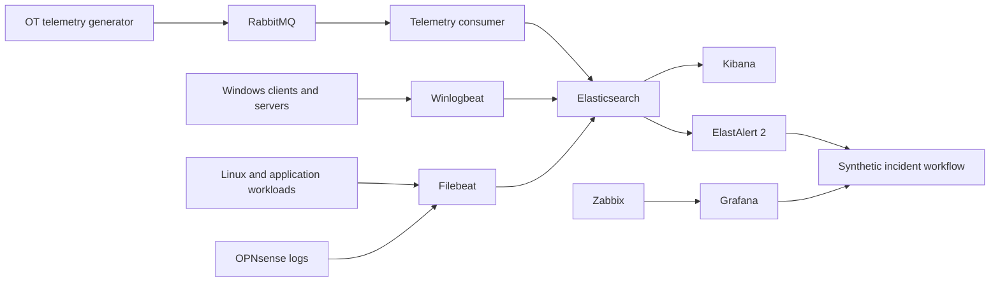

# Northstar Monitoring and Detection

Northstar separates infrastructure monitoring from log investigation while allowing both to feed the same synthetic incident workflow.

## Responsibilities

### Elastic
Central event search, correlation and investigation data.

### Beats
- **Winlogbeat** collects Windows event telemetry.
- **Filebeat** collects Linux, application and selected appliance logs.

### RabbitMQ telemetry path
Synthetic OT events are generated locally, published to RabbitMQ, consumed by the lab telemetry service and written to Elasticsearch as structured documents. Backlog and outage scenarios can therefore be injected without touching real infrastructure.

### ElastAlert 2
Rule-based detection against Elasticsearch indexes. The lab uses a mounted configuration and rules directory. Every rule should be tested against synthetic fixtures before it is used in a scenario. ElastAlert 2 provides `elastalert-test-rule` for configuration/filter validation and replay-style testing. citeturn0search0turn0search1

### Zabbix and Grafana
Infrastructure health and operational dashboards are kept conceptually separate from event investigation so the lab demonstrates multiple operational views rather than treating one tool as the answer to every monitoring problem.

## Initial detection set

- failed authentication burst
- privileged group change
- DNS failure pattern
- service stopped
- RabbitMQ queue backlog
- OT telemetry silence
- repeated firewall denies

## Minimum viable demo

1. Start one Windows client, one Linux server and one monitoring node.
2. Generate normal events.
3. Inject one controlled fault.
4. Confirm telemetry arrives.
5. Validate the relevant ElastAlert 2 rule.
6. Record synthetic incident evidence.
7. Investigate the timeline.
8. Restore the service.
9. Record root cause and recovery evidence.

## Operational principle
Every alert should answer:

1. What changed?
2. Why did the rule match?
3. What evidence is available?
4. Who owns the first response?
5. How is recovery verified?

## Safety boundary
All identities, hosts, telemetry and incidents are fictional. Do not commit credentials or reuse real employer/client data.
